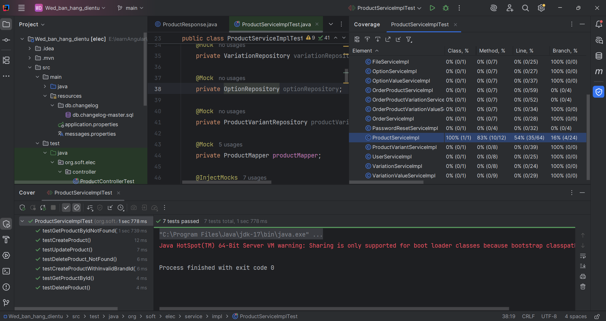
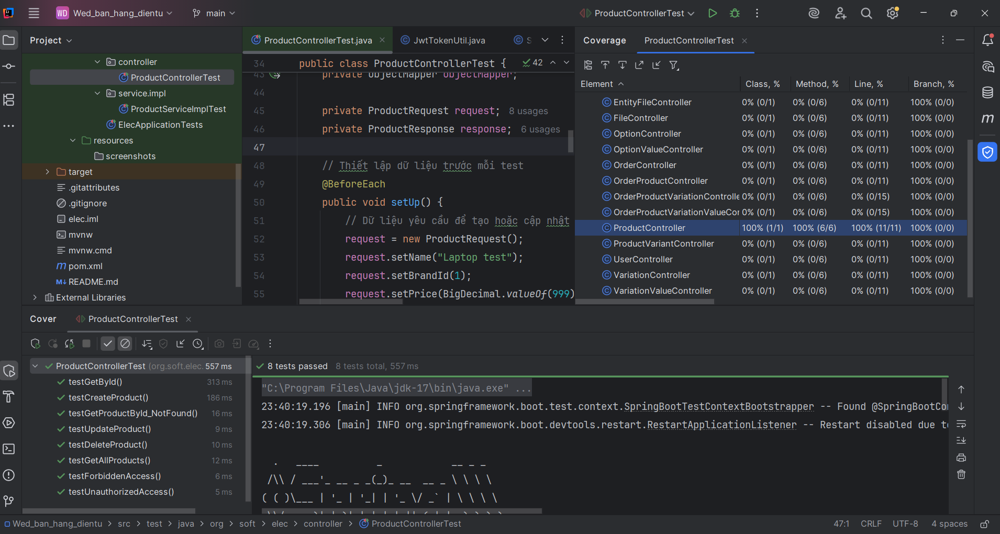

#  Midterm Report – Kiểm thử Đơn vị và Tích hợp

##  Phần 2: Kiểm thử đơn vị và kiểm thử tích hợp (20 điểm)

###  2.1. Kiểm thử đơn vị (Unit Testing) – 10 điểm

####  Mục tiêu:
Kiểm thử logic nghiệp vụ trong lớp `ProductServiceImpl`, đảm bảo các chức năng hoạt động đúng ở cấp đơn vị, gồm: tạo sản phẩm, cập nhật, xóa, lấy theo ID.

####  Công cụ sử dụng:
- **JUnit 5**: để tổ chức và thực thi test.
- **Mockito**: để giả lập (`mock`) các repository/phụ thuộc.

####  Các phương thức đã kiểm thử:

| Test Case                                | Mô tả                                                   | Kết quả mong đợi                                 |
|------------------------------------------|----------------------------------------------------------|--------------------------------------------------|
| `testCreateProduct()`                    | Tạo sản phẩm thành công                                  | Trả về `ProductResponse` với id hợp lệ           |
| `testUpdateProduct()`                    | Cập nhật sản phẩm theo ID                                | Trả về phản hồi có id đúng                       |
| `testGetProductById()`                   | Lấy sản phẩm theo ID tồn tại                             | Trả về `ProductResponse` tương ứng               |
| `testDeleteProduct()`                    | Xóa sản phẩm theo ID                                     | Không ném lỗi                                    |
| `testGetProductByIdNotFound()`           | Lỗi khi ID không tồn tại                                 | Ném `AppException(PRODUCT_NOT_FOUND)`           |
| `testCreateProductWithInvalidBrandId()` | Lỗi khi brandId không tồn tại                            | Ném `AppException(BRAND_NOT_FOUND)`             |
| `testDeleteProduct_NotFound()`          | Lỗi khi xóa sản phẩm không tồn tại                       | Ném `AppException(PRODUCT_NOT_FOUND)`           |

####  Kết quả:
- Tất cả test **pass 100%**.
- Kết hợp với JaCoCo để kiểm tra độ phủ mã.

####  Hình ảnh minh họa:
> 

---

###  2.2. Kiểm thử tích hợp (Integration Testing) – 10 điểm

####  Mục tiêu:
Kiểm thử tích hợp giữa các thành phần controller → service (mock), kiểm tra phản hồi HTTP từ REST API.

####  Công cụ sử dụng:
- **@WebMvcTest**: kiểm thử controller lớp `ProductController` độc lập.
- **MockMvc**: mô phỏng gửi request HTTP.
- **Mockito**: mock tầng service.

####  Các endpoint đã kiểm thử:

| HTTP Method | Endpoint                 | Mô tả                         | Status mong đợi         |
|-------------|--------------------------|-------------------------------|--------------------------|
| `POST`      | `/api/v1/products`       | Tạo sản phẩm mới              | `200 OK`, có `id`        |
| `PUT`       | `/api/v1/products/{id}`  | Cập nhật sản phẩm             | `200 OK`, có `id`        |
| `DELETE`    | `/api/v1/products/{id}`  | Xóa sản phẩm                  | `200 OK`                 |
| `GET`       | `/api/v1/products/{id}`  | Lấy sản phẩm theo ID          | `200 OK`, có `id`        |
| `GET`       | `/api/v1/products`       | Lấy toàn bộ sản phẩm          | `200 OK`, list có item   |
| `GET`       | `/api/v1/products/999`   | ID không tồn tại              | `404`, Product not found |

####  Kết quả:
- Tất cả test kiểm thử API đều đúng định dạng JSON, HTTP status chính xác.
- Đảm bảo controller mapping đúng đường dẫn, xử lý lỗi đúng (nếu chưa dùng exception handler thì sẽ trả 404).

####  Sơ đồ tích hợp:

```
[HTTP Client]
     |
     v
[ProductController] <---> [ProductService (mock)]
```

> Lưu ý: Tầng repository và DB không tham gia test (vì dùng mock).

####  Hình ảnh minh họa:
> 

---

###  Tổng kết phần 2:
- Viết đầy đủ **15 test case** (7 đơn vị + 8 tích hợp).
- Sử dụng JaCoCo để đo **code coverage**.
- Test có kiểm tra cả **trường hợp thành công + lỗi**.

